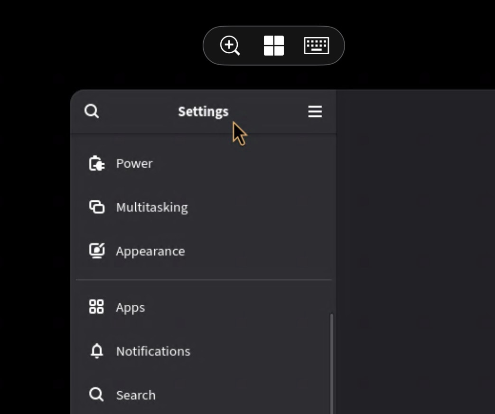

# Cursor-overlay

### GNOME Extension for creating cursor overlay

## Configuration

- Overlay shape
  - Circle
  - Cursor (Xcursor from your system cursor)
  - Image

- Per-monitor toggle (Disable/Enable on Meta-0)

## Why?

Intended to used with **gnome-remote-desktop**.

"Extend" mode is used to make your iPad a second screen, but cursor is somehow invisible on extend mode.

This extenstion will add a virtual cursor for you to see on your iPad.

## Screenshot

